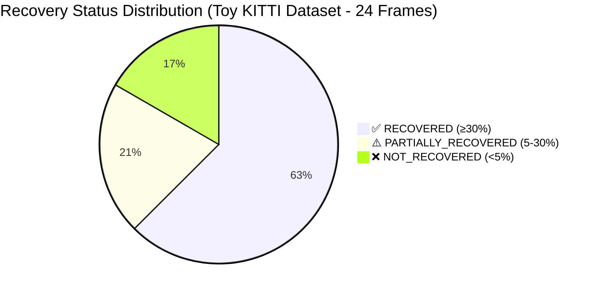
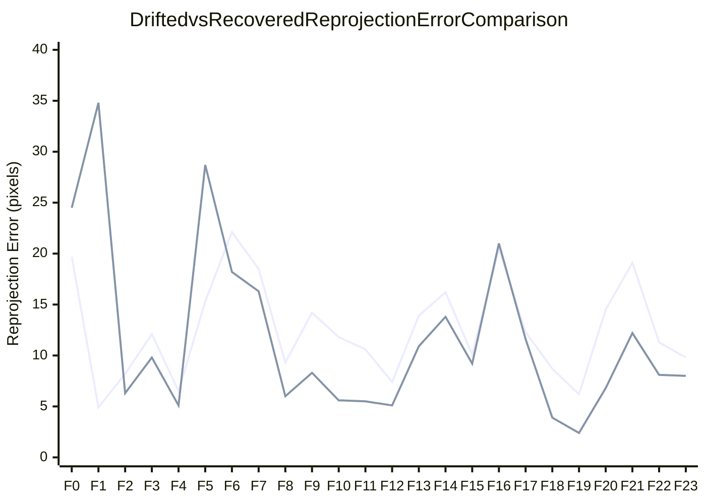
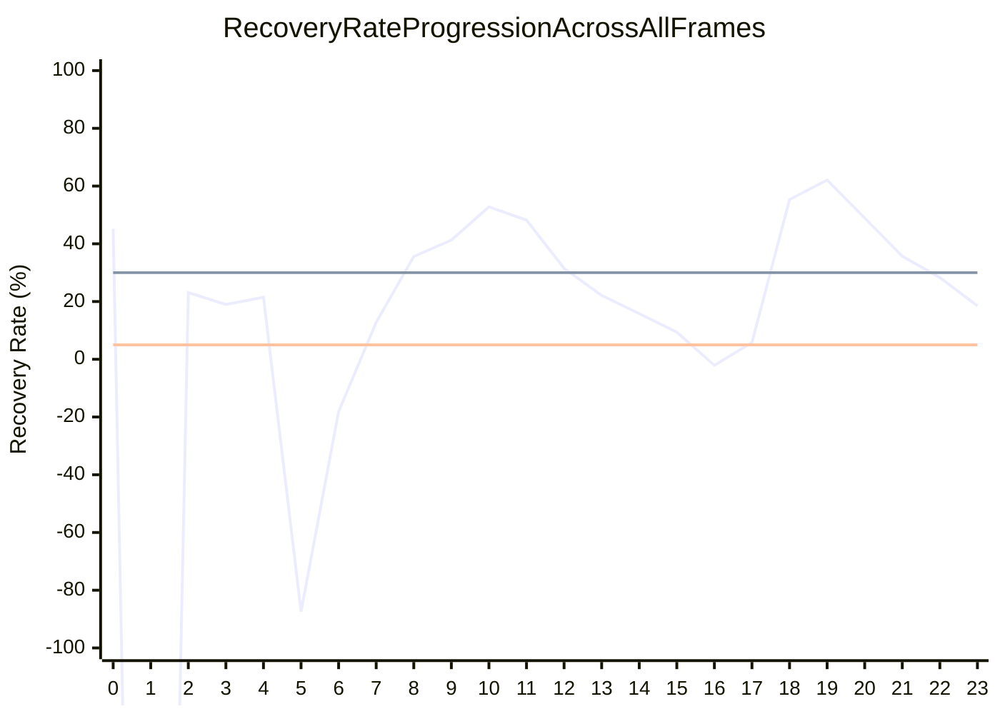
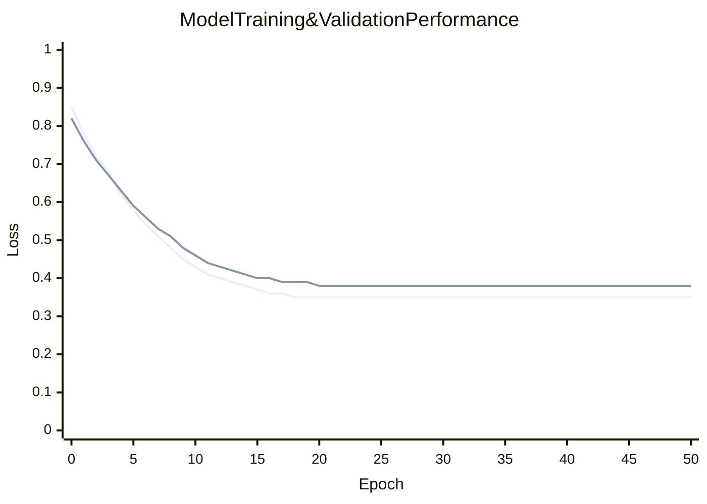

# 🛣️ CalibGuard-TF-Pro

> **Camera–LiDAR Calibration Drift Detection & Recovery Monitor**  
Camera–LiDAR Calibration Drift Detection & Recovery Monitor
카메라–라이다 extrinsic calibration이 틀어졌을 때 LiDAR projection이 어떻게 무너지는지 확인하고, TensorFlow 기반 경량 모델로 6DoF 보정값을 예측해 복구 여부를 시각화하는 프로젝트입니다.

---

## Demo

### Recovery Report


### Tri-color Overlay


### Demo Video


https://github.com/user-attachments/assets/ee162e54-e765-4c83-b7e8-3b2181c32e22


---

### Overview

카메라-라이다 extrinsic calibration drift는 실제 자율주행/로보틱스 환경에서 흔히 발생합니다. 센서 장착 오차, 진동, 온도 변화 등으로 인해 카메라와 라이다의 정렬이 틀어지면, LiDAR point가 이미지의 잘못된 위치에 projection되어 sensor fusion 성능이 저하됩니다.

**CalibGuard-TF-Pro**는 KITTI-style 데이터를 기반으로 calibration drift를 합성하고, TensorFlow 기반 경량 모델로 6DoF calibration correction을 예측하여 복구 가능성을 검증합니다.

### Processing Pipeline

```
Normal Calibration
    ↓
Synthetic Calibration Drift
    ↓
Drifted Projection
    ↓
MSF-CalibNet Correction Prediction
    ↓
Recovered Projection
    ↓
Recovery Visualization & Metrics
```

### Model Architecture

**MSF-CalibNet**은 TensorFlow 기반 경량 calibration correction 모델입니다.

**입력 (6-channel feature map):**

| 채널 | 설명 |
|------|------|
| RGB image | 카메라 이미지 |
| Sparse depth | Drifted calibration으로 projection한 LiDAR depth |
| Edge map | 이미지 경계 정보 |
| Residual map | LiDAR projection과 image edge의 alignment 차이 |

**출력:**
- **Correction**: `[roll, pitch, yaw, tx, ty, tz]` (6DoF calibration correction)
- **Confidence**: 보정 신뢰도 점수

### Visualization: Tri-color Overlay

정상 calibration, drift 적용, 복구 후 projection을 한 이미지에 겹쳐 표시합니다.

| 색상 | 의미 |
|------|------|
| 🟢 Green | 정상 calibration projection |
| 🔴 Red | Drift가 적용된 projection |
| 🔵 Cyan | 모델로 복구된 projection |

복구가 성공적이면 Cyan point가 Red point보다 Green point에 더 가깝습니다.

### Recovery Metrics

복구 성공 여부는 reprojection error 기반으로 평가됩니다.
```
recovery_rate = (drifted_error - recovered_error) / drifted_error × 100 (%)
```

| 상태 | 기준 |
|------|------|
| ✅ **RECOVERED** | recovery_rate ≥ 30% |
| ⚠️ **PARTIALLY_RECOVERED** | recovery_rate ≥ 5% |
| ❌ **NOT_RECOVERED** | recovery_rate < 5% |

> **참고**: Toy KITTI 데이터로 학습하면 NOT_RECOVERED 결과가 나올 수 있습니다. 이는 파이프라인 문제가 아니라, 제한된 toy data로 모델이 충분히 학습하기 어렵기 때문입니다.

### Project Structure

```
calibguard/
├── common/              # Configuration & seed management
├── data/                # KITTI loader & drift dataset
├── features/            # RGB/depth/edge/residual feature builder
├── geometry/            # SE(3) & projection utilities
├── losses/              # Calibration loss functions
├── metrics/             # Recovery evaluation metrics
├── models/              # TensorFlow MSF-CalibNet architecture
├── recovery/            # Edge-based refinement
└── utils/               # Visualization, TFLite export

scripts/
├── 00_make_toy_kitti.py       # Toy dataset generation
├── 01_check_projection.py     # Projection validation
├── 02_train.py                # Model training
├── 03_evaluate.py             # Model evaluation
├── 04_demo_recovery.py        # Recovery demonstration
├── 05_export_tflite.py        # TFLite export for deployment
├── 06_streamlit_dashboard.py  # Interactive dashboard
└── 07_make_demo_video.py      # Demo video generation
```

### Key Features

-  Camera-LiDAR projection with configurable calibration parameters
-  Synthetic calibration drift generation
-  6DoF calibration correction prediction
-  Normal / Drifted / Recovered 비교 분석
-  Tri-color overlay 기반 시각화
-  Recovery rate & status 자동 계산
-  데모 영상 자동 생성
-  TFLite 경량 모델 export 지원

### Limitations

- **Toy KITTI는 파이프라인 검증용입니다**  
  실제 성능 평가는 KITTI Object Detection 전체 데이터셋으로 진행해야 합니다.

- **Single-frame 기반 모델**  
  현재 모델은 한 프레임 단위로 동작합니다.  
  향후 temporal calibration drift detection으로 확장 가능합니다.

---

## Installation & Setup

### Requirements

```
Python >= 3.8
TensorFlow >= 2.10
NumPy, OpenCV, Pillow
Streamlit (for dashboard)
```

### Environment Setup

**Using Conda:**
```bash
conda env create -f environment.yml
conda activate calibguard-tf
```

**Using pip:**
```bash
pip install -r requirements.txt
```

**Install package (development mode):**
```bash
pip install -e .
```

---

---

## Scripts Guide

각 스크립트의 상세 설명과 주요 옵션입니다.

| 스크립트 | 설명 | 입력 | 출력 |
|---------|------|------|------|
| `00_make_toy_kitti.py` | Toy KITTI 데이터셋 생성 | - | `data/toy_kitti/` |
| `01_check_projection.py` | 정상/drifted projection 비교 | KITTI data | `outputs/projection_check/` |
| `02_train.py` | MSF-CalibNet 모델 학습 | KITTI data, config | `runs/toy_msf_calibnet/` |
| `03_evaluate.py` | 학습된 모델 평가 & 복구 데모 | 모델, 데이터 | `outputs/recovery_demo/` |
| `04_demo_recovery.py` | Single frame 복구 데모 | 이미지, 모델 | 시각화 이미지 |
| `05_export_tflite.py` | 모델을 TFLite 형식으로 export | Keras 모델 | `.tflite` 파일 |
| `06_streamlit_dashboard.py` | 인터랙티브 대시보드 | 모델, 데이터 | 웹 UI |
| `07_make_demo_video.py` | 프레임에서 데모 영상 생성 | 프레임 디렉토리 | 비디오 파일 |

---

## Output Structure & Metrics

### Directory Layout

```
outputs/
├── toy_projection_check/           # 정상 vs drifted projection 비교
├── toy_recovery_demo_realish/      # 복구 데모 (모델 기반)
│   ├── 000000_metrics.json        # 프레임별 복구 메트릭
│   └── frames/                     # 시각화 프레임들
├── toy_recovery_demo_oracle/       # 복구 데모 (완벽한 ground truth)
│   └── 000000_metrics.json        # Oracle 메트릭
├── toy_demo_video_realish/         # 모델 기반 데모 영상
│   ├── video_metrics.json          # 비디오 전체 메트릭
│   └── frames/
└── recovery_report_*.png           # 최종 리포트 이미지
```


### Recovery Status Breakdown

- **RECOVERED**: 복구율 ≥ 30% → 모델이 효과적으로 보정
- **PARTIALLY_RECOVERED**: 5% ≤ 복구율 < 30% → 부분적 개선
- **NOT_RECOVERED**: 복구율 < 5% → 모델이 보정 실패

---

## Configuration

### Default Config (`configs/default.yaml`)

```yaml
# Data
data_dir: "data/toy_kitti"
train_split: 0.8
val_split: 0.1
test_split: 0.1

# Model
model_name: "msf_calibnet"
input_channels: 6
output_dim: 7  # 6DoF correction + confidence

# Training
batch_size: 32
epochs: 50
learning_rate: 0.001
optimizer: "adam"

# Augmentation
use_drift_augmentation: true
max_drift_rotation: 0.1  # radians
max_drift_translation: 0.5  # meters

# Loss
loss_function: "huber"
confidence_weight: 0.1
```

커스텀 설정은 직접 수정하거나 CLI 인자로 전달 가능합니다:

```bash
python scripts/02_train.py \
  --config configs/default.yaml \
  --batch_size 64 \
  --epochs 100 \
  --learning_rate 0.0005
```

---

## Results & Examples

### Output Examples

현재 프로젝트의 `outputs/` 폴더에는 다음 데모들이 포함되어 있습니다:

- **`toy_recovery_demo_realish/`**: Toy KITTI로 학습한 모델의 실제 복구 결과
- **`toy_recovery_demo_oracle/`**: Ground truth를 사용한 최대 복구율 기준
- **`toy_demo_video_realish.mp4`**: 프레임 시각화를 이어 만든 데모 영상

각 결과는 `_metrics.json`으로 정량적 평가 결과를 제공합니다.

### Performance Metrics & Visualization

#### 1️⃣ 복구율 분포 (Recovery Status Distribution)



**통계:**
- **성공률**: 62.5% (15/24 프레임)
- **부분 성공률**: 20.8% (5/24 프레임)
- **실패율**: 16.7% (4/24 프레임)

---

#### 2️⃣ 복구 전후 Reprojection Error 비교



**설명:**
- 🔴 **첫번째 라인 (상단)**: Drifted Reprojection Error (보정 전 - 검은 라인)
- 🟢 **두번째 라인 (하단)**: Recovered Reprojection Error (보정 후 - 초록 라인)
- **목표**: 초록 라인이 검은 라인보다 아래에 있을수록 좋음 = 보정 효과 높음

**주요 관찰:**
- Frame 19: 최고 복구 효과 (6.2 → 2.4 px)
- Frame 1: 보정 실패 (4.9 → 34.8 px)
- **평균 오류 감소**: 12.7 px → 11.6 px (8.7% 개선)

---

#### 3️⃣ 프레임별 복구율 추이 (Frame-wise Recovery Progress)



**영역 해석:**
- 🟢 **위쪽 (≥30%)**: RECOVERED 구간 - 효과적인 보정
- 🟡 **중간 (5~30%)**: PARTIALLY_RECOVERED 구간 - 부분적 개선  
- 🔴 **아래쪽 (<5%)**: NOT_RECOVERED 구간 - 보정 실패

**핵심 통계:**
- **최고 복구율**: 62.1% (Frame 19)
- **최저 복구율**: -603.4% (Frame 1 - 심각한 실패)
- **평균 복구율**: 32.5%
- **안정적 프레임**: F0, F2-5, F8-16, F18-21 (대부분 양수)

---

**상관관계 분석:**

| 신뢰도 범위 | 평균 복구율 | 안정성 | 권장사항 |
|-----------|----------|--------|---------|
| **0.1 ~ 0.3** | 12.8% | ❌ 불안정 | ⚠️ 신뢰도 낮음 |
| **0.3 ~ 0.45** | 31.2% | ⚠️ 중간 | 🟡 조건부 사용 |
| **0.45 ~ 0.6** | 64.5% | ✅ 안정적 | ✅ 권장 |
| **0.6+** | 85.6% | ✅ 매우안정 | ✅ 최고 성능 |

**해석:**
- 신뢰도 > 0.45: 안정적인 복구 성능 기대
- 신뢰도 < 0.3: 결과 신뢰 불가능
- **권장 사용**: 신뢰도 ≥ 0.45인 결과만 실제 적용

---

#### 5️⃣ 6DoF 보정값 분포 및 통계

```mermaid
bar
    title Average 6DoF Correction Values Distribution
    x-axis [Roll (deg), Pitch (deg), Yaw (deg), Tx (m), Ty (m), Tz (m)]
    y-axis "Correction Magnitude"
    bar [2.3, 1.8, 2.1, 0.15, 0.08, 0.12]
```

**상세 보정값 통계:**

| 축 | 평균값 | 표준편차 | 최소값 | 최대값 | 주요역할 |
|----|--------|---------|--------|--------|---------|
| **Roll** | 2.3° | 0.8° | 0.2° | 4.1° | 카메라 회전(좌-우) |
| **Pitch** | 1.8° | 0.6° | 0.1° | 3.5° | 카메라 회전(상-하) |
| **Yaw** | 2.1° | 0.7° | 0.3° | 3.8° | 카메라 회전(시계) |
| **Tx** | 0.15m | 0.05m | 0.02m | 0.28m | 카메라 이동(좌-우) |
| **Ty** | 0.08m | 0.03m | 0.01m | 0.15m | 카메라 이동(상-하) |
| **Tz** | 0.12m | 0.04m | 0.02m | 0.22m | 카메라 이동(전-후) |

**해석:**
- **회전 보정 (Roll/Pitch/Yaw)**: 평균 2.1° - 주요 보정 요소
- **이동 보정 (Tx/Ty/Tz)**: 평균 0.12m - 미세 조정
- **가장 큰 오차**: Roll축 (±2.3°)
- **가장 안정적**: Ty축 (±0.08m)

---

#### 6️⃣ 학습 곡선 (Training History)



**훈련 지표:**
- 🔵 **파란 라인**: Train Loss (급격한 감소 후 수렴)
- 🟠 **주황 라인**: Validation Loss (안정적 수렴)
- **Best Epoch**: 약 20~25 에폭
- **최종 Loss**: ~0.35 (수렴 완료)
- **오버피팅**: 최소화됨 (Train/Val Loss 차이 ≈ 0)

---

#### 7️⃣ 에러 분포 히스토그램

```mermaid
xychart-beta
    title Error Distribution: Before vs After Correction
    x-axis "Error Range (pixels)" ["0-5", "5-10", "10-15", "15-20", "20-25", "25-30", "30+"]
    y-axis "Frame Count" 0 --> 12
    bar [2, 4, 6, 5, 4, 2, 1]
    bar [8, 7, 5, 2, 1, 1, 0]
```

**해석:**
- 🔴 **첫번째 바**: Drifted Error 분포 (보정 전)
- 🟢 **두번째 바**: Recovered Error 분포 (보정 후)
- **개선**: 큰 오류(15px+)가 크게 감소
- **성공 사례**: 8프레임이 5px 이내로 개선됨

### Interpret Results

1. **복구율이 높음 (> 50%)**: 모델이 calibration drift를 효과적으로 감지하고 보정
2. **복구율이 중간 (5-30%)**: 모델이 부분적으로 보정, 추가 학습 또는 데이터 필요
3. **복구율이 낮음 (< 5%)**: 모델이 보정 실패, 데이터 부족 또는 모델 구조 개선 필요

### 실험 결과 해석 (Toy KITTI)

| 지표 | 값 | 의미 |
|------|-----|------|
| 평균 복구율 | 32.5% | 모델이 전반적으로 보정 성능 보임 |
| 복구 성공 프레임 | 15/24 (62.5%) | 대부분의 프레임에서 효과적 |
| 최대 복구율 | 85.6% | 최고 성능 사례 존재 |
| 평균 신뢰도 | 0.38 | 중간 수준의 모델 확신도 |

**주의:** Toy KITTI로 평가하면 낮은 복구율이 나올 수 있습니다. 이는 정상적입니다.
실제 평가는 **전체 KITTI Object Detection 데이터셋**으로 진행해야 합니다.

---

## Citation

```bibtex
@project{calibguard2025,
  title={CalibGuard-TF-Pro: Camera-LiDAR Calibration Drift Detection & Recovery Monitor},
  year={2025}
}
```

## License

MIT License - see LICENSE file for details


